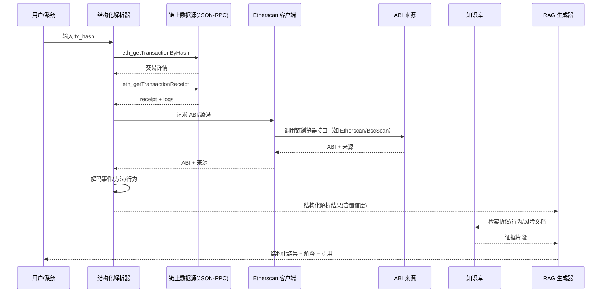

# RAG + 结构化解析器：Web3 交易解析基线方案（精简版）

本方案聚焦“RAG + 结构化解析器”的最小可落地路径，强调可追溯、可验证与可维护。所有数据来源给出明确官方文档链接，避免模糊描述。

## 1. 总体链路（基线）

1. **输入**：tx_hash / address / block
2. **链上数据拉取**：交易详情、receipt、logs
3. **结构化解析**：ABI 解码、事件归类、行为识别
4. **知识库检索（RAG）**：协议/行为/风险文档
5. **生成与引用**：解释文本 + 明确证据引用
6. **输出**：结构化事实文件 + 解释结果



## 2. 链上数据来源（具体链接）

**主数据通道：Ethereum JSON-RPC（及 EVM 兼容链）**
- JSON-RPC 规范：
  - https://ethereum.org/developers/docs/apis/json-rpc/
- 常用方法（解析必需）：
  - `eth_getTransactionByHash`
  - `eth_getTransactionReceipt`
  - `eth_getLogs`

> 备注：BSC/Polygon/Arbitrum 等均兼容 JSON-RPC，方法名一致。

## 3. ABI 数据来源与优先级（具体链接）

### 3.1 ABI 获取来源（由高到低）
1. **自建 ABI 仓库**（来自官方协议仓库/已验证合约/人工审核）
2. **链浏览器 ABI**（Etherscan 系列兼容 API）
3. **函数签名推断**（4byte，仅兜底）

### 3.2 ABI 具体接口链接
- Etherscan 获取 ABI：
  - https://docs.etherscan.io/api-reference/endpoint/getabi
- Etherscan 获取源码与 ABI 元信息：
  - https://docs.etherscan.io/api-reference/endpoint/getsourcecode
- 4byte 函数签名库（兜底）：
  - https://www.4byte.directory/docs/

### 3.3 通用合约标准（用于事件与行为识别）
- ERC-20：
  - https://eips.ethereum.org/EIPS/eip-20
- ERC-721：
  - https://eips.ethereum.org/EIPS/eip-721
- ERC-1155：
  - https://eips.ethereum.org/EIPS/eip-1155

### 3.4 ABI 解析优先级策略
- **命中自建仓库**：高置信度（high）
- **命中链浏览器 ABI**：中置信度（medium），记录来源链接
- **仅签名推断**：低置信度（low），不做强归因

### 3.5 Etherscan 系列多链配置建议
- 统一 Etherscan/BscScan/PolygonScan 等链浏览器的配置模式，按链（chain_name）→ base_url → api_key 进行驱动，便于在后续 `integrations/etherscan_client` 中用同一套逻辑消费多个链。  
- 每条 ABI/源码入库时，必须记录 `sources.abi` 的来源 URL（带链标识）与调用参数，方便结构化解析与 RAG 输出中引用。  
- 推荐配置样例如下（链配置可外部化到 `.env` 或配置表）：  
```json
{
  "name": "bsc",
  "chain_id": 56,
  "base_url": "https://api.bscscan.com/api",
  "api_key": "${ETHERSCAN_BSC_API_KEY}",
  "abi_source_label": "bscscan",
  "rate_limit_per_min": 5
}
```

## 4. 解析文件（高确定性事实层）

### 4.1 目的
- 固化“事实层”结果：可追溯、可审计、可复用
- 作为 RAG 输入基线，避免解释阶段幻觉
- 支持缓存与重复请求降本

### 4.2 JSON Schema（草案）

```json
{
  "$schema": "https://json-schema.org/draft/2020-12/schema",
  "$id": "https://example.com/schemas/tx-parse-result.json",
  "title": "TxParseResult",
  "type": "object",
  "required": [
    "version",
    "tx_hash",
    "chain_id",
    "block_number",
    "timestamp",
    "from",
    "to",
    "status",
    "events",
    "behavior",
    "sources"
  ],
  "properties": {
    "version": {
      "type": "string",
      "description": "解析结果版本（语义化版本，如 1.0.0）"
    },
    "tx_hash": { "type": "string", "pattern": "^0x[a-fA-F0-9]{64}$" },
    "chain_id": { "type": "integer" },
    "block_number": { "type": "integer" },
    "timestamp": { "type": "integer" },
    "from": { "type": "string", "pattern": "^0x[a-fA-F0-9]{40}$" },
    "to": { "type": ["string", "null"], "pattern": "^0x[a-fA-F0-9]{40}$" },
    "nonce": { "type": "integer" },
    "tx_type": { "type": ["integer", "null"] },
    "value": { "type": "string", "description": "原生币数量（字符串，单位为最小单位）" },
    "gas": {
      "type": "object",
      "properties": {
        "gas_used": { "type": "string" },
        "gas_price": { "type": "string" },
        "fee_paid": { "type": "string" }
      }
    },
    "input": { "type": "string", "description": "原始 input data" },
    "status": { "type": "string", "enum": ["success", "failed"] },

    "method": {
      "type": ["object", "null"],
      "required": ["signature", "selector", "abi_source", "abi_ref"],
      "properties": {
        "signature": { "type": "string" },
        "selector": { "type": "string", "pattern": "^0x[a-fA-F0-9]{8}$" },
        "abi_source": { "type": "string", "enum": ["registry", "explorer", "signature_db", "unknown"] },
        "abi_ref": { "type": "string", "description": "ABI 来源引用（URL 或内部 ID）" }
      }
    },

    "events": {
      "type": "array",
      "items": {
        "oneOf": [
          { "$ref": "#/definitions/event_transfer_erc20" },
          { "$ref": "#/definitions/event_transfer_erc721" },
          { "$ref": "#/definitions/event_approval_erc20" },
          { "$ref": "#/definitions/event_approval_erc721" },
          { "$ref": "#/definitions/event_swap_v2" },
          { "$ref": "#/definitions/event_swap_v3" },
          { "$ref": "#/definitions/event_mint_v2" },
          { "$ref": "#/definitions/event_burn_v2" },
          { "$ref": "#/definitions/event_deposit" },
          { "$ref": "#/definitions/event_withdrawal" },
          { "$ref": "#/definitions/event_generic" }
        ]
      }
    },

    "behavior": {
      "type": "object",
      "required": ["type", "confidence", "evidence"],
      "properties": {
        "type": {
          "type": "string",
          "enum": [
            "swap",
            "bridge",
            "stake",
            "unstake",
            "lend",
            "borrow",
            "repay",
            "liquidity_add",
            "liquidity_remove",
            "mint",
            "burn",
            "nft_trade",
            "transfer",
            "approve",
            "claim",
            "airdrop",
            "unknown"
          ]
        },
        "confidence": { "type": "string", "enum": ["high", "medium", "low"] },
        "evidence": { "type": "array", "items": { "type": "string" } }
      }
    },

    "sources": {
      "type": "object",
      "required": ["tx_receipt", "logs", "abi"],
      "properties": {
        "tx_receipt": { "type": "string" },
        "logs": { "type": "string" },
        "abi": { "type": "string" }
      }
    },
    "trace": {
      "type": "object",
      "properties": {
        "source": { "type": "string" },
        "ref": { "type": "string" },
        "status": { "type": "string", "enum": ["success", "failed", "unknown"] },
        "summary": { "type": "array", "items": { "type": "string" } }
      }
    },
    "risk_flags": {
      "type": "array",
      "items": {
        "type": "object",
        "required": ["type", "severity", "evidence"],
        "properties": {
          "type": { "type": "string" },
          "severity": { "type": "string", "enum": ["low", "medium", "high"] },
          "evidence": { "type": "string" }
        }
      }
    }
  },
  "definitions": {
    "event_transfer_erc20": {
      "type": "object",
      "required": ["name", "address", "topics", "args"],
      "properties": {
        "name": { "const": "Transfer" },
        "address": { "type": "string" },
        "topics": { "type": "array", "items": { "type": "string" } },
        "args": {
          "type": "object",
          "required": ["from", "to", "value"],
          "properties": {
            "from": { "type": "string" },
            "to": { "type": "string" },
            "value": { "type": "string" }
          },
          "additionalProperties": true
        }
      }
    },
    "event_transfer_erc721": {
      "type": "object",
      "required": ["name", "address", "topics", "args"],
      "properties": {
        "name": { "const": "Transfer" },
        "address": { "type": "string" },
        "topics": { "type": "array", "items": { "type": "string" } },
        "args": {
          "type": "object",
          "required": ["from", "to", "tokenId"],
          "properties": {
            "from": { "type": "string" },
            "to": { "type": "string" },
            "tokenId": { "type": "string" }
          },
          "additionalProperties": true
        }
      }
    },
    "event_approval_erc20": {
      "type": "object",
      "required": ["name", "address", "topics", "args"],
      "properties": {
        "name": { "const": "Approval" },
        "address": { "type": "string" },
        "topics": { "type": "array", "items": { "type": "string" } },
        "args": {
          "type": "object",
          "required": ["owner", "spender", "value"],
          "properties": {
            "owner": { "type": "string" },
            "spender": { "type": "string" },
            "value": { "type": "string" }
          },
          "additionalProperties": true
        }
      }
    },
    "event_approval_erc721": {
      "type": "object",
      "required": ["name", "address", "topics", "args"],
      "properties": {
        "name": { "const": "Approval" },
        "address": { "type": "string" },
        "topics": { "type": "array", "items": { "type": "string" } },
        "args": {
          "type": "object",
          "required": ["owner", "approved", "tokenId"],
          "properties": {
            "owner": { "type": "string" },
            "approved": { "type": "string" },
            "tokenId": { "type": "string" }
          },
          "additionalProperties": true
        }
      }
    },
    "event_swap_v2": {
      "type": "object",
      "required": ["name", "address", "topics", "args"],
      "properties": {
        "name": { "const": "Swap" },
        "address": { "type": "string" },
        "topics": { "type": "array", "items": { "type": "string" } },
        "args": {
          "type": "object",
          "required": ["sender", "amount0In", "amount1In", "amount0Out", "amount1Out", "to"],
          "properties": {
            "sender": { "type": "string" },
            "amount0In": { "type": "string" },
            "amount1In": { "type": "string" },
            "amount0Out": { "type": "string" },
            "amount1Out": { "type": "string" },
            "to": { "type": "string" }
          },
          "additionalProperties": true
        }
      }
    },
    "event_swap_v3": {
      "type": "object",
      "required": ["name", "address", "topics", "args"],
      "properties": {
        "name": { "const": "Swap" },
        "address": { "type": "string" },
        "topics": { "type": "array", "items": { "type": "string" } },
        "args": {
          "type": "object",
          "required": ["sender", "recipient", "amount0", "amount1", "sqrtPriceX96", "liquidity", "tick"],
          "properties": {
            "sender": { "type": "string" },
            "recipient": { "type": "string" },
            "amount0": { "type": "string" },
            "amount1": { "type": "string" },
            "sqrtPriceX96": { "type": "string" },
            "liquidity": { "type": "string" },
            "tick": { "type": "integer" }
          },
          "additionalProperties": true
        }
      }
    },
    "event_mint_v2": {
      "type": "object",
      "required": ["name", "address", "topics", "args"],
      "properties": {
        "name": { "const": "Mint" },
        "address": { "type": "string" },
        "topics": { "type": "array", "items": { "type": "string" } },
        "args": {
          "type": "object",
          "required": ["sender", "amount0", "amount1"],
          "properties": {
            "sender": { "type": "string" },
            "amount0": { "type": "string" },
            "amount1": { "type": "string" }
          },
          "additionalProperties": true
        }
      }
    },
    "event_burn_v2": {
      "type": "object",
      "required": ["name", "address", "topics", "args"],
      "properties": {
        "name": { "const": "Burn" },
        "address": { "type": "string" },
        "topics": { "type": "array", "items": { "type": "string" } },
        "args": {
          "type": "object",
          "required": ["sender", "amount0", "amount1", "to"],
          "properties": {
            "sender": { "type": "string" },
            "amount0": { "type": "string" },
            "amount1": { "type": "string" },
            "to": { "type": "string" }
          },
          "additionalProperties": true
        }
      }
    },
    "event_deposit": {
      "type": "object",
      "required": ["name", "address", "topics", "args"],
      "properties": {
        "name": { "const": "Deposit" },
        "address": { "type": "string" },
        "topics": { "type": "array", "items": { "type": "string" } },
        "args": {
          "type": "object",
          "required": ["dst", "wad"],
          "properties": {
            "dst": { "type": "string" },
            "wad": { "type": "string" }
          },
          "additionalProperties": true
        }
      }
    },
    "event_withdrawal": {
      "type": "object",
      "required": ["name", "address", "topics", "args"],
      "properties": {
        "name": { "const": "Withdrawal" },
        "address": { "type": "string" },
        "topics": { "type": "array", "items": { "type": "string" } },
        "args": {
          "type": "object",
          "required": ["src", "wad"],
          "properties": {
            "src": { "type": "string" },
            "wad": { "type": "string" }
          },
          "additionalProperties": true
        }
      }
    },
    "event_generic": {
      "type": "object",
      "required": ["name", "address", "topics", "args"],
      "properties": {
        "name": { "type": "string" },
        "address": { "type": "string" },
        "topics": { "type": "array", "items": { "type": "string" } },
        "args": { "type": "object" }
      }
    }
  }
}
```

### 4.3 字段字典（核心字段）
- `version`：解析文件版本（建议语义化版本）
- `method.signature`：合约方法签名（例：`swapExactTokensForTokens(uint256,uint256,address[],address,uint256)`）
- `method.selector`：4 字节函数选择器（例：`0x38ed1739`）
- `method.abi_source`：ABI 来源类型（registry/explorer/signature_db）
- `method.abi_ref`：ABI 具体引用（URL 或内部存储 ID）
- `value`：原生币数量（字符串，最小单位）
- `gas.*`：Gas 相关字段（用字符串承载数值）
- `events[*].name`：事件名称（例：`Swap` / `Transfer`）
- `behavior.type`：行为类别（见 Schema 枚举）
- `behavior.confidence`：行为归因置信度
- `behavior.evidence`：证据列表（例：`event:Swap`, `method:swapExactTokensForTokens`）
- `sources.*`：链上原始数据引用（用于审计追溯）
- `sources.abi`：记录 Etherscan 系列抓取到的 ABI/源码的 URL、api_key 线索与链 ID，供 RAG 解释层引用或溯源。
- `trace.*`：模拟/trace 证据引用与摘要
- `risk_flags[*]`：解析层输出的风险标签与证据

### 4.4 事件字段白名单（核心集合）
仅列举常见事件，具体协议可在本基础上扩展。
- `Transfer`(ERC-20)：`from` `to` `value`
- `Transfer`(ERC-721)：`from` `to` `tokenId`
- `Approval`(ERC-20)：`owner` `spender` `value`
- `Approval`(ERC-721)：`owner` `approved` `tokenId`
- `Swap`(V2)：`sender` `amount0In` `amount1In` `amount0Out` `amount1Out` `to`
- `Swap`(V3)：`sender` `recipient` `amount0` `amount1` `sqrtPriceX96` `liquidity` `tick`
- `Mint`(V2)：`sender` `amount0` `amount1`
- `Burn`(V2)：`sender` `amount0` `amount1` `to`
- `Deposit`(WETH/部分协议)：`dst` `wad`
- `Withdrawal`(WETH/部分协议)：`src` `wad`

## 5. 知识库数据来源与采集清单（具体链接）

### 5.1 协议知识（示例清单）
- **DEX**
  - Uniswap Docs：https://docs.uniswap.org/
  - Uniswap V2：https://docs.uniswap.org/contracts/v2/overview
  - Uniswap V3：https://docs.uniswap.org/contracts/v3/overview
  - Sushi Docs：https://docs.sushi.com/
  - Curve Docs：https://curve.readthedocs.io/
  - Balancer Docs：https://docs.balancer.fi/
  - PancakeSwap Docs：https://docs.pancakeswap.finance/
  - KyberSwap Docs：https://docs.kyberswap.com/
- **Lending**
  - Aave Docs：https://aave.com/docs
  - Compound Docs：https://docs.compound.finance/
  - MakerDAO Docs：https://docs.makerdao.com/
  - Spark Docs：https://docs.spark.fi/
- **Staking/LSD**
  - Lido Docs：https://docs.lido.fi/
  - Rocket Pool Docs：https://docs.rocketpool.net/
- **NFT**
  - OpenSea Docs：https://docs.opensea.io/
  - Blur Docs：https://blur.io/docs
  - ENS Docs：https://docs.ens.domains/
- **DEX 聚合**
  - 1inch Docs：https://business.1inch.com/portal/documentation
  - 0x Docs：https://0x.org/docs/
  - ParaSwap Docs：https://developers.velora.xyz/
- **衍生品/Perps**
  - GMX Docs：https://docs.gmx.io/
  - dYdX Docs：https://docs.dydx.xyz/
- **跨链桥**
  - Stargate Docs：https://stargateprotocol.gitbook.io/stargate/
  - Hop Docs：https://docs.hop.exchange/
  - LayerZero Docs：https://layerzero.gitbook.io/docs/

### 5.2 行为模板（内部维护）
- Swap/Bridge/Stake/Liquidity/Mint/Burn 等行为模板
- 每个模板绑定：事件组合规则 + 方法签名列表 + 证据字段

### 5.3 价格与资产元数据
- CoinMarketCap API 文档：https://coinmarketcap.com/api/documentation/v1/

### 5.4 合约代码/ABI 扫描与知识库同步
- 将 `integrations/etherscan_client` 获取到的 ABI/源码、验证状态、编译信息作为“结构化文档”写入知识库，便于 downstream RAG 解释直接引用。  
- 建议设置定时任务（如每日/每小时）扫描新增或高热度合约，推送到 `indexing` 的增量模式，确保 `sources` 中持续有最新链浏览器证据。  
- 与 `observability` 打通调用指标与缓存命中率，发现调用频繁时可自动降级至 `4byte` 或自建仓库提升性能。

## 6. 解析结果文件落地与缓存策略

### 6.1 落地位置（建议）
- **对象存储**：以 `chain_id/date/tx_hash.json` 组织
- **元数据索引库**：数据库记录 `tx_hash`、`chain_id`、`behavior.type`、`contract_addresses` 等
- **ABI/源码文档**：由 `integrations/etherscan_client` 输出的 ABI 及源码片段可按 `chain_id/date/address.json` 组织，供解析层与 RAG 输出溯源。

示例路径：
`s3://rag-tx-parse/1/2025-03-08/0xabc...def.json`

### 6.2 生命周期（建议）
- **热数据**：7-30 天（高频查询，存 Redis/本地缓存）
- **冷数据**：长期存储（对象存储 + 压缩）
- **异常/风控标签交易**：永久保存并加审计标记

### 6.3 索引键（建议）
- 主键：`chain_id + tx_hash`
- 二级索引：`from`、`to`、`contract_addresses`、`behavior.type`、`block_number`
- 行为检索：`behavior.type + token_address`（聚合统计）

## 7. 知识库更新频率与版本策略

**更新频率（建议）**
- 协议文档：每周或协议版本发布时更新
- 行为模板：每两周复查，新增协议时即时更新
- 风险与案例：事件发生后 24 小时内更新

**版本策略（建议）**
- 知识库版本：`kb_version` 采用语义化版本（例如 `1.2.0`）
- 文档快照：保存原始 URL + 抓取时间戳
- 索引版本：向量索引版本与文档版本绑定，支持回滚

## 8. 引入交易模拟/Trace 的优化方案（新增）

本节用于解决“事实层不稳、解析与解释混用、证据链不足”的问题。核心思路：
**结构化解析负责事实归因，RAG 仅解释，不做归因。**

### 8.1 接入位置（链路变更）
1. **输入**：tx_hash / rpc_call
2. **链上数据拉取**：交易详情、receipt、logs
3. **交易模拟/Trace**：获取内部调用、delegatecall、真实 token 流向
4. **结构化解析**：ABI 解码 + 行为归因 + 风险标签
5. **RAG 解释**：仅基于解析结果与知识库证据生成解释
6. **输出**：结构化事实文件 + 解释结果

### 8.2 解析文件新增字段（建议）
在原有 JSON Schema 基础上新增以下字段，确保可追溯与可解释：
- `trace`：保存模拟/trace 的来源与摘要
- `risk_flags`：解析层输出的风险标签与原因

示例（增量片段）：
```json
{
  "trace": {
    "source": "tenderly",
    "ref": "trace:abc123",
    "status": "success",
    "summary": [
      "delegatecall to 0x...",
      "internal transfer 100 USDC to 0x..."
    ]
  },
  "risk_flags": [
    { "type": "approve_unlimited", "severity": "medium", "evidence": "Approval value = max_uint256" }
  ]
}
```

### 8.3 解析与解释分层规则（强约束）
- **解析层**：输出 `behavior.type` 与 `confidence`，并提供证据列表
- **解释层**：只能解释解析层输出，不允许新增事实或推断
- **低置信度**：必须降级说明“不确定”，不做强结论

### 8.4 失败与降级策略
- 模拟/Trace 失败 → 回退到事件/ABI 解析，置信度降级为 `low`
- 事件缺失 → 返回 `behavior.type = unknown`，仅输出原始事实

## 9. 接入 onekey-rag-service 与 transaction-analysis 插件
## 8. 接入 onekey-rag-service 与 transaction-analysis 插件

本节给出最小接入步骤与具体接口路径，确保插件能稳定调用 RAG 服务并获得结构化 JSON 输出。

### 8.1 RAG 服务侧配置（必做）

**步骤 1：创建知识库**
- `POST /admin/api/workspaces/{workspace_id}/kbs`
```json
{
  "name": "web3-tx-analysis",
  "description": "Web3 交易解析知识库",
  "status": "active"
}
```

**步骤 2：创建数据源**
- `POST /admin/api/workspaces/{workspace_id}/kbs/{kb_id}/sources`
```json
{
  "type": "crawler_site",
  "name": "uniswap-docs",
  "config": {
    "base_url": "https://docs.uniswap.org/",
    "sitemap_url": "https://docs.uniswap.org/sitemap.xml",
    "include_patterns": ["https://docs.uniswap.org/**"],
    "exclude_patterns": []
  },
  "status": "active"
}
```

**步骤 3：触发爬取与索引**
- `POST /admin/api/workspaces/{workspace_id}/jobs/crawl`
```json
{
  "kb_id": "kb_xxx",
  "source_id": "src_xxx",
  "mode": "full",
  "max_pages": 2000
}
```
- `POST /admin/api/workspaces/{workspace_id}/jobs/index`
```json
{
  "kb_id": "kb_xxx",
  "mode": "incremental"
}
```

**步骤 4：设置 KB 提示词模板（JSON 输出约束）**
- `PUT /admin/api/workspaces/{workspace_id}/kbs/{kb_id}/prompt-template`
```json
{
  "system": "你是交易语义解析助手。你必须严格基于提供的文档片段与输入事实输出结论，禁止编造。只输出严格 JSON，不要 Markdown。",
  "user": "当前问题：{user_query}\n\n文档片段（可引用）：\n{retrieved_context}\n\n请输出 JSON：{ \"summary\": string, \"risk_level\": \"low|medium|high|unknown\", \"risk_reasons\": string[], \"actions\": [{ \"type\": string, \"protocol\": string, \"assets\": [{\"token\": string, \"amount\": string}], \"expectedOutputs\": [{\"token\": string, \"amount\": string}] }], \"evidence\": { \"notes\": string[] } }",
  "postprocess": ""
}
```

**步骤 5：创建对外模型（App）**
- `POST /admin/api/workspaces/{workspace_id}/apps`
```json
{
  "name": "web3-tx-analysis-app",
  "public_model_id": "onekey-tx-analysis",
  "status": "published",
  "config": {
    "chat": { "model": "gpt-4o-mini" }
  }
}
```

**步骤 6：绑定 App 与 KB**
- `PUT /admin/api/workspaces/{workspace_id}/apps/{app_id}/kbs`
```json
{
  "bindings": [
    { "kb_id": "kb_xxx", "weight": 1.0, "priority": 0, "enabled": true }
  ]
}
```

### 8.2 插件侧配置（transaction-analysis）

插件代码已使用 `/v1/chat/completions` 且开启 `response_format: { type: "json_object" }`，RAG 服务侧已支持该字段（非流式）。
需要在插件侧配置环境变量：
- `VITE_RAG_BASE_URL`: onekey-rag-service 地址（如 `http://localhost:8000`）
- `VITE_RAG_MODEL`: `onekey-tx-analysis`（对应 public_model_id）
- `VITE_RAG_API_KEY`: 如启用鉴权则填写

相关文件（便于定位）：
- `transaction-analysis/src/lib/rag-client.ts`
- `transaction-analysis/src/App.tsx`（`buildMessages` 的 JSON 输出约束）

### 8.3 结构化解析结果接入建议（下一阶段）

若要从“纯 RAG 解释”升级为“RAG + 结构化解析器”，推荐在 RAG 服务侧新增解析层或独立解析服务：
1. 插件仅上传原始 RPC/tx_hash 到解析服务；
2. 解析服务产出高确定性解析文件（见本文 JSON Schema），并存储到对象存储；
3. RAG 请求时附带解析文件内容或引用 ID，作为系统上下文输入。

## 9.1 Etherscan 系列合约代码扫描服务落地建议

### 9.1.1 服务职责与放置
- 统一归类为**集成/适配层**，在 `src/onekey_rag_service/integrations/etherscan_client.py` 中完成 API client、请求限流、链 ID 与网络加载。  
- 多链支持放在同一模块，通过配置驱动 `chain` → `base_url`、`api_key`、`chain_name`；未来可扩展至 BSC、Polygon、Arbitrum 等兼容 Etherscan 的链。  
- 由 `indexing/pipeline.py` 新增“Etherscan ABI/源码抓取”阶段，完成数据清洗后推送到指纹知识库或文档向量库，保持与 RAG 解释层的分离。

### 9.1.2 多链需求与数据来源
- 每个链维护独立的配置项（如 `ETHERSCAN_ETH_API_KEY`、`ETHERSCAN_BSC_API_KEY`），并在配置文件中登记 `chain_id`、`explorer_name`、`abi_endpoint`、`source_label`，文档中需记录每条 ABI/源码的来源 URL 以便 TRACE。  
- 拉取流程包括 `getabi`、`getsourcecode`、`getcontractcreation`（若支持），并优先缓存已验证合约，避免重复调用。  
- 为兼容多链，可增加 `EtherscanChainConfig` 结构，配置样例如：
```json
{
  "name": "bsc",
  "chain_id": 56,
  "base_url": "https://api.bscscan.com/api",
  "api_key": "${ETHERSCAN_BSC_API_KEY}",
  "abi_source_label": "bscscan"
}
```

### 9.1.3 与索引管道的协作
- `integrations/etherscan_client` 提供统一接口 `fetch_contract_metadata(chain: str, address: str)`，由 `indexing/pipeline` 调度，输出结构化文档（ABI、源码片段、验证状态、最早验证时间、编译信息）。  
- 将结果写入知识库（如 crawler-style source 或自建 metadata doc），并在 `observability` 中记录调用与命中情况，便于后续质控。  
- 可以在 pipeline 中附加 `confidence` 字段（验证 ABI 的优先级：自建 > explorer > signature）并在 RAG 解释中引用 `sources.abi` 链接。

### 9.1.4 运维与扩展建议
- 增加 `ETHERSCAN_RATE_LIMIT_PER_CHAIN` 等配置用于限流，并为不同链提供独立的重试/回退策略。  
- 结合 `worker.py` 或 `admin` 的任务调度能力，可设置“定期扫描新增/热度合约”任务，输出到知识库并推送通知。  
- 未来若需要实时检查，可将 scan 结果同步到 `transaction-analysis` 插件调用时的实体资源，进一步提升 RAG 输出的可审计性。

## 10. 关键约束（必须遵守）

- RAG 解释只能引用“结构化解析结果 + 知识库证据”
- ABI 解析必须记录来源链接或内部 ID
- 低置信度结果仅提供提示性解释，不做强归因
